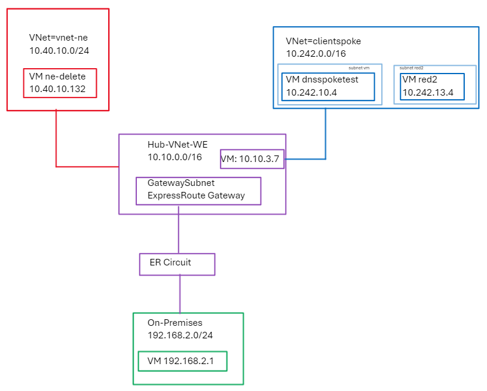
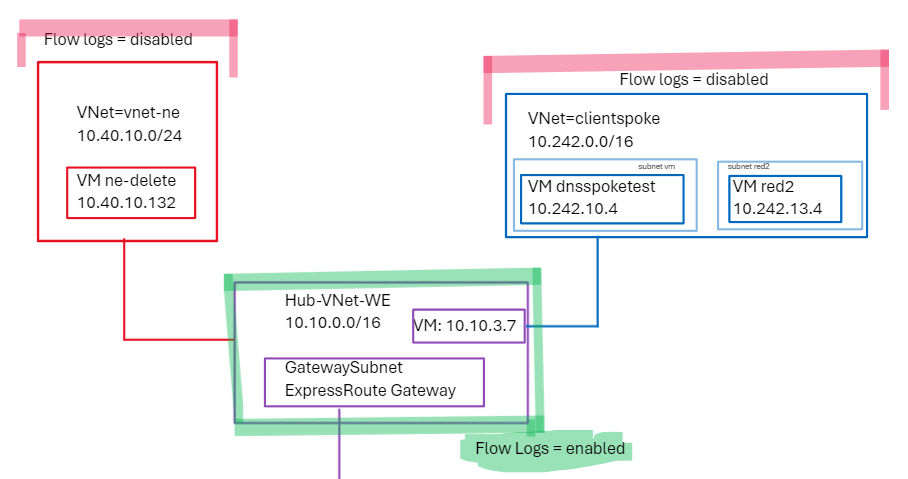
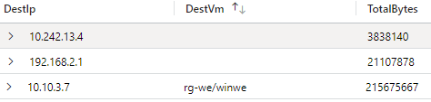
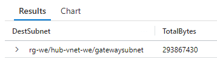
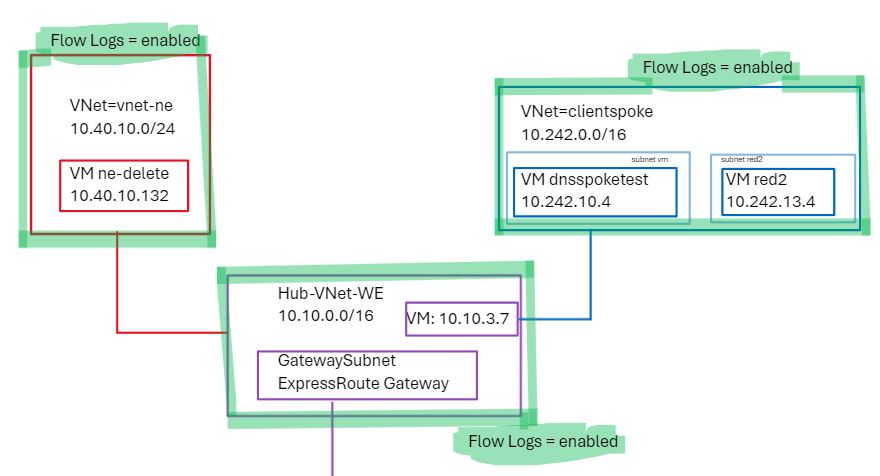
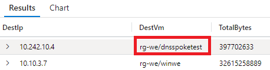
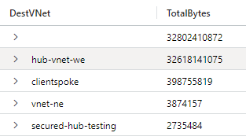
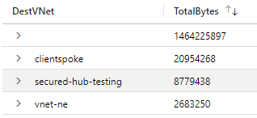
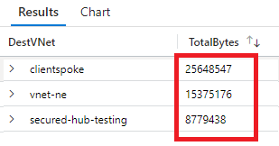

# Where should I enable Virtual Network (VNet) Flow Logs?
Discussion of the decision where to apply Virtual Network Flow Logs, impact of Hub-enablement only contrasted with Spoke enablement.

# Introduction
This document assumes the reader is familiar with VNet Flow logs as a technology. If not the links below will help:

- https://blog.cloudtrooper.net/2024/05/08/vnet-flow-logs-recipes/
- https://learn.microsoft.com/en-us/azure/network-watcher/traffic-analytics-schema?WT.mc_id=Portal-fx&tabs=vnet#fields-used-in-traffic-analytics-schema
- https://techcommunity.microsoft.com/t5/azure-networking-blog/network-traffic-observability-with-virtual-network-flow-logs/ba-p/4112907
- https://youtu.be/lvQM2K_77TI

# Enablement
One of the primary benefits of VNet Flow Logs (vs NSG Flow Logs) is the ability to enable on mass, at the VNet level, irrespective of if you are using NSG or not. You can also enable VNet Flow Logs at the subnet or NIC level, but this is a less popular config.

Customers in Azure often run Hub/Spoke topologies like the one shown below, wherein many _Spoke_ Virtual Neworks connect to a single centralised _Hub_ Virual Network. With the latter containing shared services including network components like Firewalls and Gateways.



# Enabling Flow Logs on Hub only



You may start to wonder, with a Hub/Spoke topology, where all flows are funneled through centralised Firewalls/Gateways, could I get away with only enabling VNet Flow Logs on the Hub VNet? What might the benefits of this be in theory?

- Less cost (less data generated), less data stored per GB in Storage Accounts, less data process by Traffic Analytics
- Less worry about using single storage account and overwhelming any limits with 100's VNets logging to same destination
- No duplication of Data Logging polluting query outputs (E.g. if you Log Purple Hub and Red Spoke, and you have a flow going through VMs in both, or a GW + VM, and you query your entire VNet Flows Logs repository, you will get double the data for that flow)
- Simplification of operations, no need to automate enablement of VNet Flow Logs at spoke level, just have central IT team do it on Hub and forget

## Example Data

### DestVM
```
NTANetAnalytics
| where SubType == 'FlowLog' and FaSchemaVersion == '3' and FlowStartTime > ago(12d)
| summarize TotalBytes=sum(BytesSrcToDest) by DestIp, DestVm
```


Notice how in the above output, the DestIP within my spoke (10.242.13.4) effectively is an unknown IP address, in the same category as 192.168.2.1 (On-Premises client). Whereas the VM within my Hub VNet (10.10.3.7) has much richer data, specifically I am able to pull our attributes such as DestVM name.

This is a reflection on the fact we have enabled VNet Flow Logs only within the Hub VNet. Therefore, we are able to pull flows out of the VNet itself, but unless the source or destination is within this VNet, we effectively lose the SDN schema.

### IntraVNet

Take a look at at the table schema, and see the field's that are available here https://learn.microsoft.com/en-us/azure/network-watcher/traffic-analytics-schema?WT.mc_id=Portal-fx&tabs=vnet#traffic-analytics-schema.

Here is another example, highlighting the same challenge with hub-only enablement.

```
NTANetAnalytics
| where SubType == 'FlowLog' and FaSchemaVersion == '3' and FlowStartTime > ago(12d)
| where FlowType == 'IntraVNet'
| summarize TotalBytes=sum(BytesSrcToDest) by DestSubnet
```


This useful field, of "FlowType" can pick out traffic going between nodes inside a VNet. But as I have enabled Flow Logs only on my Hub, I am only seeing Hub Intra-VNet traffic, not all of the chatter happening in my Spokes. In this case I am just seeing a lot of traffic within the GatewaySubnet, between the underlying ER Gateway Nodes.

### Virtual WAN

It is worth acknowledging that this approach of enabling them only on the hub VNet is not compatible with Virtual WAN topologies, as today, you will not see the option to enable VNet Flow Logs on your Virtual WAN Hub.

### Summary

I would recommend this approach only if you want a very light weight deployment, where you log for example traffic on centralised firewall/NVA NICs to get a low resolution view of your topology, where most data has to be aggregated based on source and destination IP data only. Also be aware that this approach, if not using a centralised firewall, and relying only on centralised gateways instead, will result in only see half (the inbound path) of ExpressRoute traffic flows.

# Enabling Flow Logs on Hub + Spokes

So we have demonstrated some negatives with hub-only enablement, so lets take a look at a more homogenous wholesale approach to enabling VNet flow logs everywhere. We need to revisit our possible negatives from earlier and approach sensibly:

- More cost (more data generated), more data stored per GB in Storage Accounts, more data process by Traffic Analytics. **Solution: Increased focus on retention timeline of data**
- More worry about using single storage account and overwhelming any limits with 100's VNets logging to same destination. **Solution: Plan to assess Storage Account limits or use multiple Storage Accounts if running very large environment with 100s VNets and 1000s nodes**
- Duplication of Data Logging polluting query outputs (E.g. if you Log Purple Hub and Red Spoke, and you have a flow going through VMs in both, or a GW + VM, and you query your entire VNet Flows Logs repository, you will get double the data for that flow). **Solution: I will demonstrate below how to scope your query to only the spoke Flow Log Resource IDs**
- Complexity of operations, need to automate enablement of VNet Flow Logs at spoke level. **Solution: Easy to enable for all VNets in a region, use Azure Policy in pipeline for new VNets8*



## Example Data

### DestVM
```
NTANetAnalytics
| where SubType == 'FlowLog' and FaSchemaVersion == '3' and FlowStartTime > ago(12d)
| summarize TotalBytes=sum(BytesSrcToDest) by DestIp, DestVm
```


Notice the change in the above output, the DestIP within my spoke (10.242.10.4) effectively is now richer in its data. I am able to pull out the DestVM name, along with any other field schema I wish to use.

This is a reflection on the fact we have enabled VNet Flow Logs on al VNets, and the fact the entire system (SDN<>Flow Logs<>Traffic Analytics) now has the ability to stitch everything together with the right level of visibility.

### Per VNet usage
```
NTANetAnalytics
| where SubType == 'FlowLog' and FaSchemaVersion == '3' and FlowStartTime > ago(12d)
| extend DestVNet = tostring(split(DestSubnet, "/")[1])
| summarize TotalBytes=sum(BytesSrcToDest) by DestVNet
```


These types of queries are where the real power of "Flow logs everywhere" shines. Because I have Flow Log coverage of each Spoke VNet, I am able to pull out the SDN data for each flow, I.e. the flow is not just a random "detached" source or destination IP address. So in the query above, I am using the "DestSubnet" field to summarize based on a per VNet level.

> NB. The traffic analytics table NTANetAnalytics does not expose a field for "VNet" directly, therefore we are using a split based extend to pull-out the VNet field, from the Subnet data, which includes VNet along with resource group.

### Duplication management

```
NTANetAnalytics
| where SubType == 'FlowLog' and FaSchemaVersion == '3' and FlowStartTime > ago(12d)
| where FlowLogResourceId != "xxxxxxxxx-4497-98dd-7bb9a70c9e1c/networkwatcherrg/networkwatcher_westeurope/hub-vnet-we-rg-we-flowlog"
| extend DestVNet = tostring(split(DestSubnet, "/")[1])
| summarize TotalBytes=sum(BytesDestToSrc) by DestVNet
```



```
NTANetAnalytics
| where SubType == 'FlowLog' and FaSchemaVersion == '3' and FlowStartTime > ago(12d)
| extend DestVNet = tostring(split(DestSubnet, "/")[1])
| summarize TotalBytes=sum(BytesDestToSrc) by DestVNet
```


In the first query above, I am filtering out any Flow Log data that came from my Hub-VNet, ```where FlowLogResourceId !=``` this results in only pulling out data from the Spoke nodes, to get true data throughput figures. Notice how the throughput figures are higher in the bottom output.


### Virtual WAN

It is worth acknowledging that this approach is the required approach if using Virtual WAN, as stated previously, we cannot use a hub-only approach with VWAN today as the VWAN Hub does not allow flow-log enablement.

### Summary--update

_I would recommend this approach only if you want a very light weight deployment, where you log for example traffic on centralised firewall/NVA NICs to get a low resolution view of your topology, where most data has to be aggregated based on source and destination IP data only. Also be aware that this approach, if not using a centralised firewall, and relying only on centralised gateways instead, will result in only see half (the inbound path) of ExpressRoute traffic flows._

-

